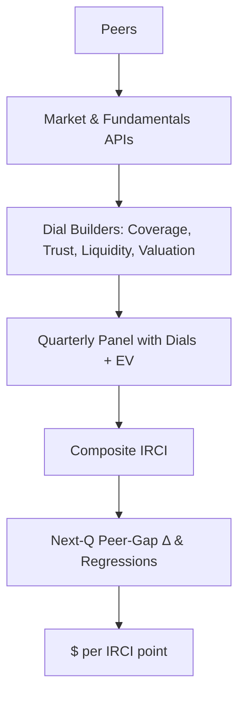

# CLAUDE.md - AI Assistant Guide for IRCI

## Project Overview

**IRCI (Investor Relations Contribution Index)** is a quantitative framework that measures how investor relations (IR) and reputation signals translate into market outcomes. The system combines four normalized metrics ("dials") into a composite IRCI score and links that score to next-quarter valuation movement and dollar sensitivity per IRCI point.

### Primary Focus
- **Main Case Study**: Big Tech companies (AAPL, MSFT, AMZN, GOOGL)
- **Secondary Demo**: Communications Services cohort (e.g., T and peers)

### Core Concept
The IRCI framework quantifies the relationship between IR quality and market valuation by:
1. Measuring four key dimensions (Coverage, Trust, Liquidity, Valuation)
2. Creating normalized 0-100 percentile scores for each dimension
3. Computing a weighted composite score
4. Validating predictive power through out-of-sample regression
5. Converting results to tangible **$ per IRCI point** metrics

---

## Current Repository State (As of Nov 2025)

### What Exists
```
IRCI/
├── README.md              # Comprehensive project documentation
├── IRCI.html              # Google Sites export with project info
├── IRCI_files/            # Web assets from Google Sites
│   └── Code Files         # Empty placeholder
└── .git/                  # Git repository
```

### What Doesn't Exist Yet
The README describes an extensive Python codebase that **has not been implemented**:
- `scripts/comm/` - Pipeline scripts for Communications cohort
- `scripts/tech/` - Pipeline scripts for Big Tech cohort (implied)
- Data fetching utilities
- Dial calculation modules
- Regression and validation code
- Output directories (`out/`, `results/`)

### Development Status
This is an **early-stage repository** with:
- ✅ Clear conceptual framework documented
- ✅ Well-defined requirements and architecture
- ❌ No actual implementation code
- ❌ No test suite
- ❌ No data pipeline
- ❌ No dependencies/requirements file

---

## The Four Dials Framework

Understanding these dials is **critical** for any development work:

### 1. Coverage Dial (0-100 percentile)
**What it measures**: Information availability and disclosure quality

**Components**:
- **SEC Cadence**: 8-K filing frequency per quarter
- **SEC Timeliness**: Days from quarter-end to 10-Q/10-K filing
- **Media Visibility**: Weighted unique articles × domain credibility

**Normalization**: Ranked within quarter; higher frequency + faster filings = higher percentile

**Data Sources**:
- SEC EDGAR API (requires User-Agent header)
- News aggregation APIs
- Media credibility scoring

### 2. Trust Dial (0-100 percentile)
**What it measures**: Market confidence and disclosure credibility

**Components**:
- **Event Calmness**: Median |factor-adjusted residual| ±3 trading days around 8-K/10-Q/10-K
- **Baseline Calmness**: Per-quarter std deviation of CAPM residuals
- **Optional Sentiment**: FinBERT/VADER tone analysis of filings

**Normalization**: Lower volatility = higher percentile

**Data Sources**:
- Market price data (Yahoo Finance, AlphaVantage, FMP)
- Factor model data (market proxy, Fama-French factors)
- SEC filing text for sentiment analysis

### 3. Liquidity Dial (0-100 percentile)
**What it measures**: Trading ease and market microstructure quality

**Components**:
- **Roll Spread Proxy**: Bid-ask spread estimation from price data
- **Amihud Illiquidity**: Price impact per dollar traded
- **Turnover**: Volume relative to shares outstanding

**Normalization**: Lower spreads/illiquidity, higher turnover = higher percentile

**Data Sources**:
- High-frequency price and volume data
- Shares outstanding data

### 4. Valuation Dial (0-100 percentile)
**What it measures**: Peer-relative attractiveness

**Components**:
- **Primary Metric**: EV/EBITDA ratio
- **Fallback Metric**: P/S ratio (if EBITDA unavailable)

**Normalization**: **Lower** valuation multiple = **higher** percentile (counterintuitive!)

**Data Sources**:
- Yahoo Finance, AlphaVantage, FMP (redundant fetching for resilience)
- Enterprise Value (EV)
- EBITDA or Sales data

### Composite Score
```python
IRCI_composite = (
    0.15 * Coverage_percentile +
    0.15 * Trust_percentile +
    0.35 * Liquidity_percentile +
    0.35 * Valuation_percentile
)
```

**Default weights**: C=0.15, T=0.15, L=0.35, V=0.35

**Optimization**: Weights can be grid-searched using `weights_search.py` to maximize test-set Information Coefficient (IC).

---

## Planned Architecture

### Directory Structure (To Be Implemented)
```
IRCI/
├── scripts/
│   ├── comm/                      # Communications Services cohort
│   │   ├── run_comm_pipeline.sh   # Master orchestration script
│   │   ├── build_coverage_comm.py # Coverage dial builder
│   │   ├── build_trust_comm.py    # Trust dial builder
│   │   ├── build_liquidity_comm.py# Liquidity dial builder
│   │   ├── build_valuation_comm.py# Valuation dial via APIs
│   │   ├── build_with_dials_from_parts.py  # Dial merger
│   │   ├── build_comm_panel.py    # Composite + target variable
│   │   ├── weights_search.py      # Grid search for dial weights
│   │   └── peer_gap_fit.py        # Regression: β and $ per point
│   └── tech/                      # Big Tech cohort (parallel structure)
├── lib/                           # Shared utilities
│   ├── data_fetchers/
│   │   ├── sec_edgar.py           # SEC filing fetcher
│   │   ├── yahoo_finance.py       # Market data
│   │   ├── alpha_vantage.py       # Alternative market data
│   │   └── fmp.py                 # Financial Modeling Prep API
│   ├── dial_calculators/
│   │   ├── coverage.py
│   │   ├── trust.py
│   │   ├── liquidity.py
│   │   └── valuation.py
│   └── utils/
│       ├── normalization.py       # Percentile ranking
│       ├── regression.py          # OLS with robust errors
│       └── factor_models.py       # CAPM, Fama-French
├── out/                           # Intermediate outputs
│   └── comm/
│       ├── peers_T.csv            # Peer list
│       ├── irci_comm_quarterly_with_dials.csv
│       └── irci_comm_quarterly.csv
├── results/                       # Final results
│   └── comm/
│       ├── weights_comm.json
│       ├── peer_gap_fit_T.json
│       └── usd_per_point_T.csv
├── tests/                         # Test suite
├── data/                          # Raw data cache
├── requirements.txt
├── setup.py
├── README.md
├── CLAUDE.md                      # This file
└── .env.example                   # Template for API keys
```

### Data Flow (Mermaid diagram from README)


---

## Key Conventions for AI Assistants

### 1. Environment Variables
**CRITICAL**: The following environment variables must be set:
```bash
FMP_API_KEY="your_financial_modeling_prep_key"
ALPHAVANTAGE_API_KEY="your_alphavantage_key"
SEC_USER_AGENT="IRCI/0.1 (email@company.com)"  # Required by SEC
```

**Never hardcode API keys**. Always use environment variables or `.env` files (excluded from git).

### 2. Data Fetching Strategy
**Redundancy is intentional**: The system fetches from multiple sources (Yahoo Finance, AlphaVantage, FMP) to ensure resilience. Implement graceful fallback:
```python
# Pseudo-code pattern
data = fetch_from_yahoo(ticker)
if data is None or data.is_incomplete():
    data = fetch_from_alphavantage(ticker)
if data is None or data.is_incomplete():
    data = fetch_from_fmp(ticker)
if data is None:
    raise DataUnavailableError(ticker)
```

### 3. Quarterly Panel Structure
All data must be aligned to **fiscal quarters**:
- **Columns**: `ticker`, `quarter_end`, `fiscal_year`, `fiscal_quarter`, `coverage_pct`, `trust_pct`, `liquidity_pct`, `valuation_pct`, `irci_composite`, `ev`, `next_q_peer_gap_change`
- **Index**: MultiIndex on `(ticker, quarter_end)`
- **Normalization**: Percentiles computed **within each quarter** across tickers

### 4. Validation Methodology
**Out-of-sample testing is mandatory**:
- **Training set**: Quarters before a cutoff date
- **Test set**: Quarters after cutoff
- **Target variable**: `next_q_peer_gap_change` (future-looking)
- **Metrics**: Information Coefficient (IC), R², regression β
- **No data leakage**: Target variable must be from the *next* quarter

### 5. Regression Output Format
The `peer_gap_fit.py` script must produce:

**JSON output** (`peer_gap_fit_T.json`):
```json
{
  "beta": -0.0234,
  "r_squared": 0.18,
  "std_error": 0.0045,
  "n_observations": 120,
  "formula": "next_q_peer_gap_change ~ irci_composite"
}
```

**CSV output** (`usd_per_point_T.csv`):
```csv
ticker,ev_usd,beta,usd_per_point
T,150000000000,-0.0234,351000000
VZ,145000000000,-0.0234,339300000
```

**Calculation**: `usd_per_point = EV * (|β| / 100)`

### 6. Code Style
- **Language**: Python 3.9+
- **Style**: PEP 8, use `black` for formatting
- **Type hints**: Mandatory for all function signatures
- **Docstrings**: Google-style docstrings for all public functions
- **Error handling**: Explicit exceptions, never silent failures
- **Logging**: Use `logging` module, not `print()` statements

Example:
```python
import logging
from typing import Optional
import pandas as pd

logger = logging.getLogger(__name__)

def fetch_market_data(
    ticker: str,
    start_date: str,
    end_date: str
) -> Optional[pd.DataFrame]:
    """Fetch daily market data for a ticker.

    Args:
        ticker: Stock ticker symbol (e.g., 'AAPL')
        start_date: Start date in 'YYYY-MM-DD' format
        end_date: End date in 'YYYY-MM-DD' format

    Returns:
        DataFrame with columns: date, open, high, low, close, volume
        None if data unavailable

    Raises:
        ValueError: If date format is invalid
    """
    logger.info(f"Fetching data for {ticker} from {start_date} to {end_date}")
    # Implementation
```

### 7. Testing Requirements
- **Unit tests**: For all dial calculation functions
- **Integration tests**: For data fetchers (use mocked APIs)
- **Regression tests**: For validation pipeline (use synthetic data)
- **Coverage target**: >80%

### 8. Dependency Management
Create a `requirements.txt` with pinned versions:
```txt
pandas==2.0.3
numpy==1.24.3
scipy==1.11.1
statsmodels==0.14.0
requests==2.31.0
yfinance==0.2.28
alpha-vantage==2.3.1
python-dotenv==1.0.0
pytest==7.4.0
black==23.7.0
mypy==1.4.1
```

---

## Domain Knowledge for AI Assistants

### Financial Concepts

**Enterprise Value (EV)**:
```
EV = Market Cap + Total Debt - Cash
```
Represents total company value including debt.

**EV/EBITDA**:
- Valuation multiple comparing enterprise value to earnings before interest, taxes, depreciation, amortization
- Lower ratio = cheaper relative to earnings = potentially undervalued

**CAPM (Capital Asset Pricing Model)**:
```
Return = α + β × Market_Return + ε
```
Used to compute factor-adjusted residuals (`ε`) for the Trust dial.

**Information Coefficient (IC)**:
- Spearman rank correlation between predicted and actual outcomes
- IC > 0.05 is considered meaningful in quantitative finance
- Used to optimize dial weights

### SEC Filing Types
- **8-K**: Current report (material events, earnings releases)
- **10-Q**: Quarterly report
- **10-K**: Annual report
- **Filing frequency**: More 8-Ks suggests active communication
- **Timeliness**: Faster 10-Q/10-K filings suggest operational efficiency

### Microstructure Metrics
- **Roll Spread**: Estimated bid-ask spread from serial price covariance
- **Amihud Illiquidity**: `|Return| / Volume` - measures price impact
- **Turnover**: Trading volume / shares outstanding - measures liquidity

---

## Common Tasks & Workflows

### Task: Implement a Dial Builder

**Example**: `build_coverage_comm.py`

1. **Input**: List of tickers, date range
2. **Fetch**: SEC filing metadata from EDGAR
3. **Compute**:
   - Count 8-Ks per quarter
   - Days from quarter-end to 10-Q filing
   - Media mentions (if available)
4. **Normalize**: Rank within each quarter → percentile
5. **Output**: CSV with `ticker`, `quarter_end`, `coverage_pct`

**Key considerations**:
- Handle missing data gracefully
- Respect SEC API rate limits (10 requests/second)
- Cache results in `data/` directory
- Log all data quality issues

### Task: Run the Full Pipeline

**Example**: Communications cohort with T as seed

```bash
# Set environment variables
export FMP_API_KEY="..."
export ALPHAVANTAGE_API_KEY="..."
export SEC_USER_AGENT="IRCI/0.1 (user@example.com)"

# Run pipeline
cd scripts/comm
bash run_comm_pipeline.sh SYMBOL=T K=12

# Outputs:
# - out/comm/peers_T.csv
# - out/comm/irci_comm_quarterly_with_dials.csv
# - out/comm/irci_comm_quarterly.csv

# Optimize weights
python weights_search.py \
  --panel ../../out/comm/irci_comm_quarterly_with_dials.csv \
  --out ../../results/comm/weights_comm.json \
  --step 0.05

# Estimate $ per point
python peer_gap_fit.py \
  --input ../../out/comm/irci_comm_quarterly.csv \
  --filter-symbols ../../out/comm/peers_T.csv \
  --out-json ../../results/comm/peer_gap_fit_T.json \
  --out-csv ../../results/comm/usd_per_point_T.csv
```

### Task: Add a New Cohort

1. **Create directory**: `scripts/new_cohort/`
2. **Copy pipeline**: Clone `scripts/comm/*` as template
3. **Adjust peer selection**: Modify peer universe logic
4. **Update weights**: Re-run `weights_search.py` on new cohort
5. **Validate**: Ensure out-of-sample R² > 0.10

---

## Data Sources & APIs

### SEC EDGAR API
- **Base URL**: `https://data.sec.gov/`
- **Rate limit**: 10 requests/second
- **Authentication**: User-Agent header required
- **Endpoints**:
  - Filing search: `/submissions/CIK{}.json`
  - Filing content: `/Archives/edgar/data/...`

**Example**:
```python
headers = {"User-Agent": os.getenv("SEC_USER_AGENT")}
response = requests.get(
    f"https://data.sec.gov/submissions/CIK{cik}.json",
    headers=headers
)
```

### Yahoo Finance (via yfinance)
- **Library**: `yfinance`
- **Rate limit**: Soft (no official limit, use responsibly)
- **Data**: OHLCV, fundamentals, splits, dividends
- **Reliability**: Good for major tickers, spotty for small-cap

### AlphaVantage
- **API Key**: Required (free tier: 5 requests/minute)
- **Base URL**: `https://www.alphavantage.co/query`
- **Functions**: `TIME_SERIES_DAILY`, `OVERVIEW`, `INCOME_STATEMENT`
- **Reliability**: Good, but rate-limited

### Financial Modeling Prep (FMP)
- **API Key**: Required (free tier: 250 requests/day)
- **Base URL**: `https://financialmodelingprep.com/api/v3/`
- **Endpoints**: `/quote/`, `/income-statement/`, `/balance-sheet/`
- **Reliability**: Excellent for fundamentals

---

## Validation & Quality Checks

### Pre-Deployment Checklist
- [ ] All dials produce 0-100 percentiles (no NaN, no values outside range)
- [ ] Quarterly alignment confirmed (no date mismatches)
- [ ] Out-of-sample test R² documented
- [ ] No data leakage (target variable is future-dated)
- [ ] API keys loaded from environment (not hardcoded)
- [ ] Logging configured to file and console
- [ ] Edge cases tested (missing data, API failures, single-ticker quarters)
- [ ] Results reproducible with fixed random seed (if applicable)

### Known Edge Cases
1. **Single ticker in quarter**: Percentile = 50 (no peer comparison)
2. **Missing EBITDA**: Fall back to P/S for valuation dial
3. **API timeout**: Retry 3 times with exponential backoff
4. **Stale cache**: Validate data freshness, refetch if >7 days old
5. **Quarterly alignment**: Some companies have non-standard fiscal quarters

---

## Git Workflow

### Branching Strategy
- **main**: Production-ready code only
- **dev**: Integration branch for features
- **feature/***: Individual feature branches
- **hotfix/***: Emergency fixes

### Commit Message Format
```
<type>(<scope>): <subject>

<body>

<footer>
```

**Types**: `feat`, `fix`, `docs`, `style`, `refactor`, `test`, `chore`

**Example**:
```
feat(coverage): implement SEC 8-K frequency calculator

- Add sec_edgar.py data fetcher
- Implement quarterly aggregation logic
- Add unit tests with mocked responses

Closes #12
```

### Pull Request Guidelines
- All PRs require tests
- Code coverage must not decrease
- PEP 8 compliance (checked by CI)
- At least one reviewer approval

---

## Troubleshooting Guide

### Issue: API Rate Limit Exceeded
**Symptoms**: `429 Too Many Requests`
**Solution**:
- Implement exponential backoff
- Add caching layer in `data/` directory
- Reduce batch size in pipeline

### Issue: Percentiles Not in 0-100 Range
**Symptoms**: `ValueError: Percentile 153.2 out of range`
**Solution**:
- Check normalization logic in `utils/normalization.py`
- Ensure `scipy.stats.rankdata` with `pct=True` is used
- Validate input data for outliers

### Issue: Low Out-of-Sample R²
**Symptoms**: R² < 0.05 on test set
**Possible causes**:
- Insufficient data (need >20 quarters)
- Poor dial quality (check data sources)
- Overfitting on training set
- Stale weights (re-run `weights_search.py`)

### Issue: Missing Data for Ticker
**Symptoms**: `DataUnavailableError: No data for XYZ`
**Solution**:
- Check ticker symbol (correct exchange suffix?)
- Try alternative API (Yahoo → AlphaVantage → FMP)
- Exclude ticker from cohort if data persistently unavailable

---

## Performance Expectations

### Processing Time (Approximate)
- **Peer selection** (12 peers): 30 seconds
- **Data fetch** (12 tickers, 5 years): 2-5 minutes
- **Dial calculation**: 1-2 minutes
- **Composite & panel**: 10 seconds
- **Weights grid search**: 5-10 minutes
- **Regression**: 1 second
- **Total pipeline**: 10-20 minutes per cohort

### Memory Usage
- **Typical panel** (12 tickers × 20 quarters): <50 MB
- **Full Big Tech** (4 tickers × 40 quarters): <20 MB
- **Cache directory**: <500 MB for 5 years of data

---

## Future Enhancements (Not Yet Implemented)

### Potential Features
- [ ] Real-time IRCI dashboard (Streamlit/Dash)
- [ ] Automated quarterly updates via cron job
- [ ] Multi-factor models (Fama-French 5-factor)
- [ ] Advanced sentiment analysis (transformer models)
- [ ] Portfolio optimization using IRCI scores
- [ ] API endpoint for IRCI lookup
- [ ] Backtesting framework for trading strategies

### Research Questions
- Does IRCI predict returns beyond 1 quarter?
- Which dial contributes most to predictive power?
- How does IRCI perform in different market regimes?
- Can IRCI identify inflection points (turnarounds)?

---

## References & Resources

### Academic Papers
- Amihud (2002): "Illiquidity and Stock Returns"
- Roll (1984): "A Simple Implicit Measure of the Effective Bid-Ask Spread"
- Fama & French (1993): "Common Risk Factors in Returns"

### APIs & Documentation
- [SEC EDGAR API Guide](https://www.sec.gov/edgar/sec-api-documentation)
- [Yahoo Finance (yfinance)](https://github.com/ranaroussi/yfinance)
- [AlphaVantage Docs](https://www.alphavantage.co/documentation/)
- [FMP API Docs](https://site.financialmodelingprep.com/developer/docs/)

### Python Libraries
- `pandas`: Data manipulation
- `statsmodels`: Regression and time series
- `scipy`: Statistical functions
- `requests`: HTTP client for APIs

---

## Contact & Maintenance

### Repository Maintainer
See commit history for primary contact: `bnatc85@gmail.com`

### Issue Reporting
For bugs or questions:
1. Check existing issues on GitHub
2. Provide minimal reproducible example
3. Include error logs and environment details
4. Tag with appropriate labels (`bug`, `enhancement`, `question`)

---

## Quick Reference

### Environment Setup
```bash
# Clone repo
git clone https://github.com/bnatc85/IRCI.git
cd IRCI

# Create virtual environment
python3 -m venv venv
source venv/bin/activate  # On Windows: venv\Scripts\activate

# Install dependencies (once requirements.txt exists)
pip install -r requirements.txt

# Set API keys
cp .env.example .env
# Edit .env with your keys
```

### Run Example Pipeline (Once Implemented)
```bash
export $(cat .env | xargs)
cd scripts/comm
bash run_comm_pipeline.sh SYMBOL=T K=12
```

### Run Tests (Once Implemented)
```bash
pytest tests/ -v --cov=lib --cov-report=html
```

---

## Important Notes for AI Assistants

1. **This codebase does not exist yet**: The README documents the intended architecture, but no Python code has been written. Treat implementation as greenfield development.

2. **Financial domain expertise required**: Understand the difference between market cap and enterprise value, percentile ranking vs. z-scores, and out-of-sample validation.

3. **Data quality is critical**: IRCI is only as good as its inputs. Implement robust error handling, data validation, and logging.

4. **No over-engineering**: Implement the architecture as described in README. Don't add unnecessary abstractions or features.

5. **Reproducibility matters**: Use fixed random seeds, document data sources, and version control all results.

6. **Security**: Never commit API keys. Use `.gitignore` for `.env`, `data/`, `out/`, `results/`.

7. **Documentation-driven development**: README and this file are the spec. Code should match exactly.

---

*Last Updated: 2025-11-23*
*Document Version: 1.0*
*Repository State: Pre-implementation (documentation only)*
