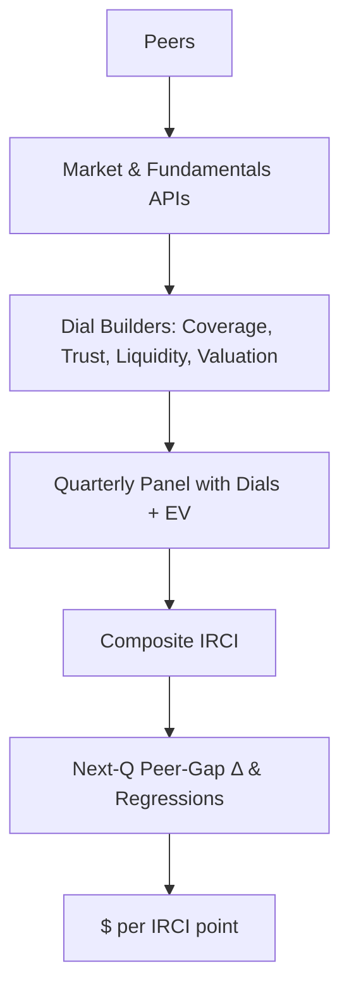

# IRCI
Investor Relations Contribution Index (IRCI)
# Investor Relations Contribution Index (IRCI)

**Primary case study:** Big Tech (AAPL, MSFT, AMZN, GOOGL).  
**Secondary demo:** Communications Services cohort (e.g., T + peers).  
This repo quantifies how **investor relations (IR)** and **reputation signals** translate into market outcomes by combining four normalized “dials” into a **composite IRCI score** and linking that score to **next‑quarter valuation movement** and **$ per IRCI point**.

---

## ✨ What IRCI Does (at a glance)
- Turns noisy IR/reputation inputs into **four dials (0–100)**:
  1) **Coverage** (SEC cadence & media visibility)  
  2) **Trust** (event‑day calmness + factor‑adjusted volatility; optional tone)  
  3) **Liquidity** (microstructure/transaction ease proxies)  
  4) **Valuation** (peer‑relative EV/EBITDA or P/S; lower → better percentile)
- Blends dials into a **composite** (weights default: `C=0.15, T=0.15, L=0.35, V=0.35`).
- Runs **out‑of‑sample validation**: IRCI (this quarter) vs **next‑quarter** peer‑gap change; converts slope to **$ sensitivity per point**.

> The original deck focuses on **Big Tech** as the main, well‑sampled case; **Communications Services** is provided as a secondary example built on lighter data.

---

## 🧭 Repo Structure (key scripts)
- `scripts/comm/run_comm_pipeline.sh` — glue script: build peers → fetch valuation & EV → build dials → merge → composite → panel outputs.
- `scripts/comm/build_*_comm.py` — per‑dial builders (coverage, trust, liquidity, valuation via Yahoo Finance).  
- `scripts/comm/build_with_dials_from_parts.py` — merges all dials + EV and normalizes schema.  
- `scripts/comm/build_comm_panel.py` — computes composite + **next‑Q peer‑gap change** target.  
- `scripts/comm/weights_search.py` — grid‑searches dial weights by test IC.  
- `scripts/comm/peer_gap_fit.py` — OLS to estimate **β (pp per IRCI pt)** and **R²**, and produce **$ per point** by ticker.

> Data fetch is redundant across **Yahoo Finance, AlphaVantage, and FMP** to ensure resiliency.

---

## 🚀 Quickstart

```bash
# Environment
export FMP_API_KEY="YOUR_FMP_KEY"
export ALPHAVANTAGE_API_KEY="YOUR_AV_KEY"
export SEC_USER_AGENT="IRCI/0.1 (you@company.com)"

# Build a Communications cohort (example with T as seed)
bash scripts/comm/run_comm_pipeline.sh SYMBOL=T K=12

# Optimize dial weights on the resulting panel (time‑split train/test)
python scripts/comm/weights_search.py \
  --panel out/comm/irci_comm_quarterly_with_dials.csv \
  --out   results/comm/weights_comm.json \
  --step  0.05

# Estimate β and $/pt for the cohort
python scripts/comm/peer_gap_fit.py \
  --input out/comm/irci_comm_quarterly.csv \
  --filter-symbols out/comm/peers_T.csv \
  --out-json results/comm/peer_gap_fit_T.json \
  --out-csv  results/comm/usd_per_point_T.csv
```

For **Big Tech**, follow a parallel flow or point the scripts at your Big Tech panel. The deck uses **AAPL/MSFT/AMZN/GOOGL** as the main demo.

---

## 🧮 The Four Dials (0–100 Percentiles)

### 1) Coverage
- **SEC cadence:** 8‑K frequency per quarter; **timeliness:** days from quarter end to 10‑Q/10‑K.  
- **Media visibility:** weighted unique articles & domains (domain credibility weights).  
- All components are **ranked within quarter** and combined; more 8‑Ks and faster 10‑Qs → higher percentile.

### 2) Trust
- **Event calmness:** median |factor‑adjusted residual| in ±3 trading days around **8‑K/10‑Q/10‑K**.  
- **Baseline calmness:** per‑quarter std of residuals from **CAPM/market proxy**.  
- Lower residual volatility ⇒ higher percentile; optional tone (FinBERT/VADER) can be blended.

### 3) Liquidity
- Microstructure proxies (e.g., **Roll spread proxy**, **Amihud illiquidity**).  
- Lower spreads / lower illiquidity / higher turnover ⇒ higher percentile (per quarter).

### 4) Valuation
- **Peer‑relative** valuation metric (EV/EBITDA primary, P/S fallback).  
- **Lower** metric ⇒ **higher** percentile within quarter.

### Composite (default)
```text
IRCI = 0.15*Coverage + 0.15*Trust + 0.35*Liquidity + 0.35*Valuation
```
Weights can be tuned by `weights_search.py` (hold‑out test IC).

---

## 📈 Validation & Dollars per Point
- Target variable: **next‑quarter change** in peer‑gap (z‑scored valuation metric).  
- Regress **Δpeer_gap_nextQ ~ IRCI_composite** with robust/clustered errors; record β and R².  
- **$ / IRCI point** per ticker:  
  ```text
  $/pt = EV * (|β| / 100)
  ```

> In the **Big Tech** deck, the slope (β) and the resulting **$ sensitivity per point** are highlighted per company to make the metric tangible.

---

## 🗺️ Data Flow (Mermaid)



---

## ⚠️ Notes & Scope
- **Primary:** Big Tech (stronger sampling; featured in the slide deck).  
- **Secondary:** Communications Services (example cohort; lighter data → more variance).  
- IRCI is a **decision support** tool: it **augments** fundamentals by improving information quality and market plumbing (not a replacement for fundamentals).

---

## License & Contact  
- Questions: open an issue or email the maintainer listed in the deck.
